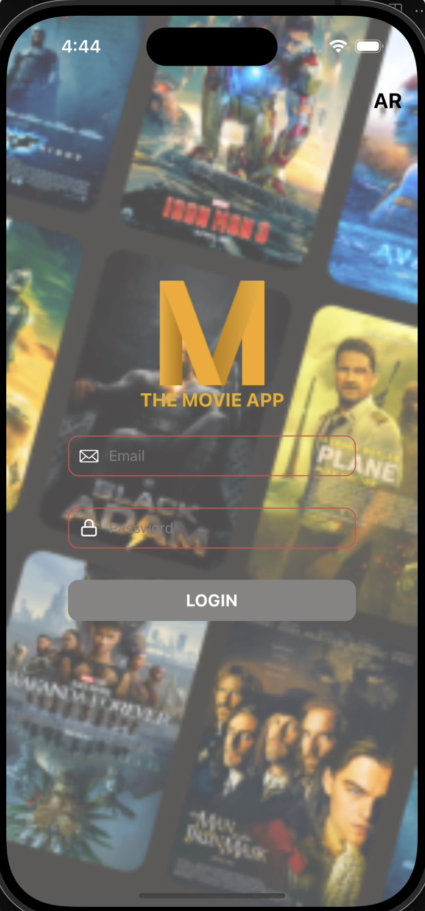
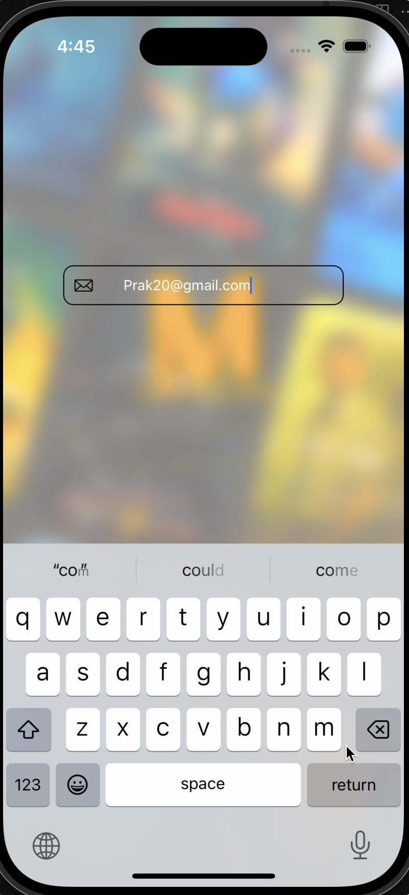
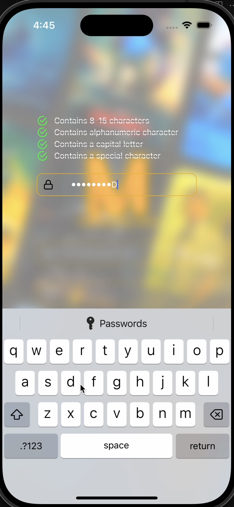
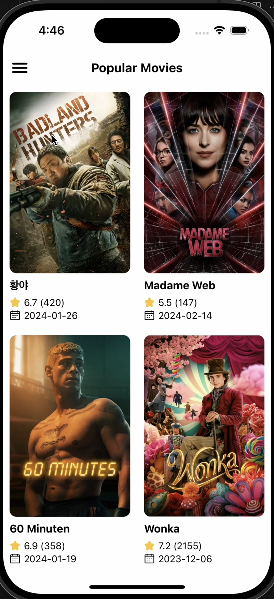
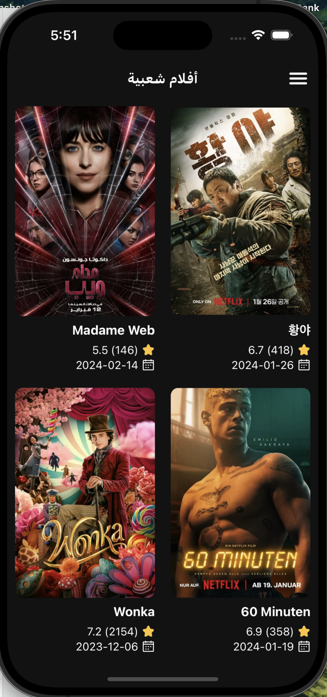
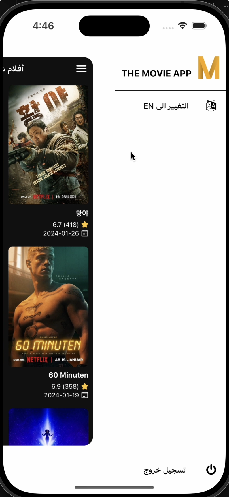
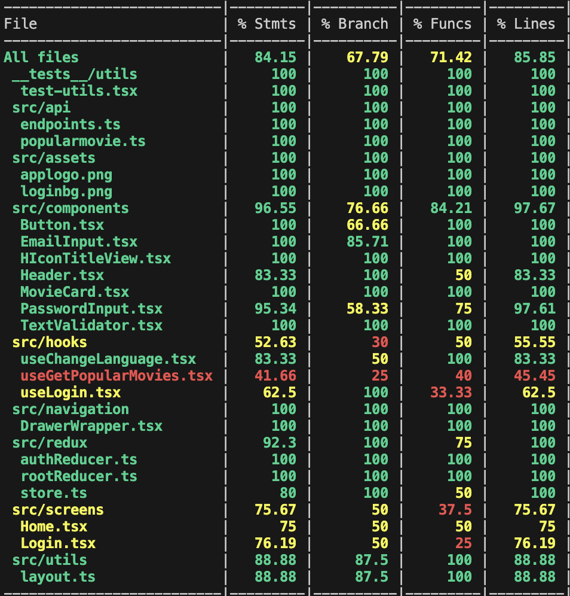

<!-- Improved compatibility of back to top link: See: https://github.com/othneildrew/Best-README-Template/pull/73 -->

<a name="readme-top"></a>

<!--
*** Thanks for checking out the Best-README-Template. If you have a suggestion
*** that would make this better, please fork the repo and create a pull request
*** or simply open an issue with the tag "enhancement".
*** Don't forget to give the project a star!
*** Thanks again! Now go create something AMAZING! :D
-->

<!-- PROJECT SHIELDS -->
<!--
*** I'm using markdown "reference style" links for readability.
*** Reference links are enclosed in brackets [ ] instead of parentheses ( ).
*** See the bottom of this document for the declaration of the reference variables
*** for contributors-url, forks-url, etc. This is an optional, concise syntax you may use.
*** https://www.markdownguide.org/basic-syntax/#reference-style-links
-->
<!-- PROJECT LOGO -->
<br />
<div align="center">
  <a href="https://github.com/othneildrew/Best-README-Template">
    
  </a>

  <h3 align="center">THE MOVIE APP</h3>

  <p align="center">
    A display project!
    <br />
  </p>
</div>

<!-- TABLE OF CONTENTS -->
<details>
  <summary>Table of Contents</summary>
  <ol>
    <li>
      <a href="#about-the-project">About The Project</a>
      <ul>
        <li><a href="#built-with">Built With</a></li>
      </ul>
    </li>
    <li>
      <a href="#getting-started">Getting Started</a>
      <ul>
        <li><a href="#prerequisites">Prerequisites</a></li>
        <li><a href="#installation">Installation</a></li>
      </ul>
    </li>
    <li><a href="#Test Coverage">Test Coverage</a></li>
    <li><a href="#Roadmap">Roadmap</a></li>
    <li><a href="#contact">Contact</a></li>
    <li><a href="#acknowledgments">Acknowledgments</a></li>
  </ol>
</details>

<!-- ABOUT THE PROJECT -->

## About The Project

 
<br />
 
<br />
 
<br />

The project implements the following usecase.

- Screen1:

1. Form contains two text fields: one is email and other one is password
2. Email must be valid email address
3. Password size limitation between 8 - 15 characters(Alpha Number with at least one Capital Letter and 1 Special Character)
4. Submit button to be enabled only in case of email & password are valid otherwise it will be disabled
5. Once Submit button is active move to next screen without any Remote API Call.

- Screen2:

1. Using Restful Web APIs load the list of popular Movies on this screen in a grid view with number of columns as 2.
2. Each Item contains the name and image. Name to be taken from the “title” and image from “poster_path” from the response.

<p align="right">(<a href="#readme-top">back to top</a>)</p>

### Built With

- [![React-Native][React-Native]][RN]
- [![Redux-url][Redux-url]][Redux.js]
- [![TS-url][tsurl]][ts.org]

<p align="right">(<a href="#readme-top">back to top</a>)</p>

<!-- GETTING STARTED -->

## Getting Started

To set up your project locally.
Get a local copy up and running follow below steps.

### Prerequisites

Node.js version > 16
JDK version >= 17

### Installation

1. Get a free API Key at [TMDB](https://www.themoviedb.org/login)
2. Clone the repo
   ```sh
   git clone https://github.com/batcodegen/themovieapp.git
   ```
3. Install NPM packages
   ```sh
   npm install
   ```
4. Create a `.env` in root folder and enter your TMDB token
   ```js
   TMDB_TOKEN = ENTER_YOUR_API;
   ```
5. Start RN packager
   ```sh
   npm start
   ```
6. Run build for ios
   ```sh
   npx react-native run-ios
   ```
7. Run build for android
   ```sh
   npx react-native run-android
   ```
   <p align="right">(<a href="#readme-top">back to top</a>)</p>

<!-- TEST COVERAGE -->

## Test Coverage

Test coverage stats below:
<br />


<p align="right">(<a href="#readme-top">back to top</a>)</p>

<!-- ROADMAP -->

## Roadmap

- [ ] Add additional testcases for 100% coverage
- [ ] Add micro-animations

<p align="right">(<a href="#readme-top">back to top</a>)</p>

<!-- CONTACT -->

## Contact

Prakhar Bangar - [Linkedin profile](https://www.linkedin.com/in/prakhar-bangar-289198a2/)

Project Link: [https://github.com/batcodegen/themovieapp](https://github.com/batcodegen/themovieapp)

<p align="right">(<a href="#readme-top">back to top</a>)</p>

<!-- ACKNOWLEDGMENTS -->

## Acknowledgments

Free icon and image resources by:

- [Img Shields](https://shields.io)
- [Vector Icons](https://github.com/oblador/react-native-vector-icons)

<p align="right">(<a href="#readme-top">back to top</a>)</p>

<!-- MARKDOWN LINKS & IMAGES -->
<!-- https://www.markdownguide.org/basic-syntax/#reference-style-links -->

[contributors-shield]: https://img.shields.io/github/contributors/othneildrew/Best-README-Template.svg?style=for-the-badge
[contributors-url]: https://github.com/othneildrew/Best-README-Template/graphs/contributors
[forks-shield]: https://img.shields.io/github/forks/othneildrew/Best-README-Template.svg?style=for-the-badge
[forks-url]: https://github.com/othneildrew/Best-README-Template/network/members
[stars-shield]: https://img.shields.io/github/stars/othneildrew/Best-README-Template.svg?style=for-the-badge
[stars-url]: https://github.com/othneildrew/Best-README-Template/stargazers
[issues-shield]: https://img.shields.io/github/issues/othneildrew/Best-README-Template.svg?style=for-the-badge
[issues-url]: https://github.com/othneildrew/Best-README-Template/issues
[license-shield]: https://img.shields.io/github/license/othneildrew/Best-README-Template.svg?style=for-the-badge
[license-url]: https://github.com/othneildrew/Best-README-Template/blob/master/LICENSE.txt
[linkedin-shield]: https://img.shields.io/badge/-LinkedIn-black.svg?style=for-the-badge&logo=linkedin&colorB=555
[linkedin-url]: https://linkedin.com/in/othneildrew
[product-screenshot1]: screenshots/sc1.png
[product-screenshot2]: screenshots/sc2.png
[product-screenshot3]: screenshots/sc3.png
[product-screenshot4]: screenshots/sc4.png
[product-screenshot5]: screenshots/sc5.png
[product-screenshot6]: screenshots/sc6.png
[React-Native]: https://img.shields.io/badge/react_native-%2320232a.svg?style=for-the-badge&logo=react&logoColor=%2361DAFB
[RN]: https://reactnative.dev/
[Redux-url]: https://img.shields.io/badge/redux-%23593d88.svg?style=for-the-badge&logo=redux&logoColor=white
[Redux.js]: https://redux.js.org/introduction/getting-started
[tsurl]: https://img.shields.io/badge/typescript-%23007ACC.svg?style=for-the-badge&logo=typescript&logoColor=white
[ts.org]: https://www.typescriptlang.org/
